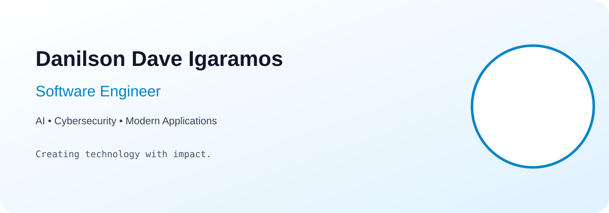

<!--
====================================================
 DANILSON DAVE IGARAMOS
 GitHub Profile README
====================================================
-->

<div align="center">



</div>

<br/>

<div align="center">

# 👋 Hi, I'm Danilson Ramos

### Software Engineer | AI Builder | Cybersecurity Enthusiast


</div>

---

# 🚀 About Me

I am a Software Engineer focused on designing and building modern digital solutions.

My work combines:

* Full-stack development
* Mobile applications
* Artificial Intelligence
* Cybersecurity
* Cloud technologies
* Automation systems

I enjoy transforming complex problems into reliable, scalable and user-focused products.

Currently building platforms around:

* Tax management
* Digital security
* AI-assisted workflows
* Productivity applications

---

# 🧠 Engineering Philosophy

```text
Clean Code
     +
Modern Architecture
     +
User Experience
     +
Security First
     =
Reliable Software
```

My approach focuses on:

* Maintainable architecture
* Performance optimization
* Scalable solutions
* Real-world impact

---

# 🛠️ Technology Stack

## Frontend

<div align="center">


</div>

## Backend

<div align="center">


</div>

## Mobile Development

<div align="center">


</div>

## AI & Data

<div align="center">


</div>

## DevOps & Tools

<div align="center">


</div>

---

# 🚀 Featured Projects

## 🧾 AtamaTax

Tax management platform designed to simplify administrative and fiscal workflows.

### Technologies

```
React
TypeScript
PHP
MySQL
REST API
Cloud
```

Main objectives:

* Digital tax organization
* Administrative automation
* Secure management workflows

---

## 🛡️ FindMyScammer

Cybersecurity-oriented investigation platform focused on scam detection and digital analysis.

### Technologies

```
Python
AI
Machine Learning
Data Analysis
Security Concepts
```

Main objectives:

* Identify suspicious activities
* Analyze digital threats
* Improve online safety

---

# 📊 GitHub Analytics

<div align="center">


<br/>


<br/>


</div>

---

# 🐍 Contribution Snake

<div align="center">


</div>

---

# 🏆 Achievements

<div align="center">


</div>

---

# 📈 Activity

<div align="center">


</div>

---

# 🧩 Professional Timeline

```
2020
 |
 | Started software development journey
 |
2022
 |
 | Built mobile and web applications
 |
2024
 |
 | Focused on AI and cybersecurity solutions
 |
2026
 |
 | Building scalable professional platforms
```

---

# 🎯 Current Focus

```yaml
learning:
  - Artificial Intelligence
  - Cybersecurity
  - Cloud Architecture

building:
  - AtamaTax
  - FindMyScammer

improving:
  - Software Architecture
  - System Design
  - Product Engineering
```

---

# 📫 Contact

<div align="center">

<a href="mailto:danilson.daveigaramos.pro@gmail.com">


</a>

<a href="https://www.linkedin.com/in/danilson-ramos-4b9482166/">


</a>

</div>

---

<div align="center">

### Building the future one commit at a time.



</div>
